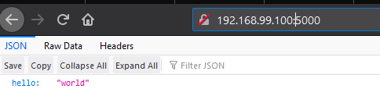
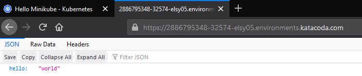

# Kubernetes
https://kubernetes.io/docs/tutorials/hello-minikube/  
Flask ft. Kubernetes
1. membuat folder appflask
2. membuat app.py untuk memunculkan hellow world
```
        from flask import Flask
    from flask_restful import Resource, Api

    app = Flask(__name__)
    api = Api(app)

    class HelloWorld(Resource):
    def get(self):
        return {'hello': 'world'}

    api.add_resource(HelloWorld, '/')

    if __name__ == '__main__':
    app.run(debug=True, host='0.0.0.0')
```
3. membuat requirtment.txt sebagai informasi paket yang dibuthkan
```
flask  
flask_restful
```
4. membuat dockerfile
```
FROM python:2.7
COPY . /app
WORKDIR /app
RUN pip install -r requirements.txt
ENTRYPOINT ["python"]
CMD ["app.py"]
```
5. build docker image
```
$ docker build -t kdzikry/appflask:v1 .
Sending build context to Docker daemon  5.632kB
Step 1/6 : FROM python:2.7
 ---> 426ba9523d99
Step 2/6 : COPY . /app
 ---> d767b4baf9a0
Step 3/6 : WORKDIR /app
 ---> Running in 29e058a26907
Removing intermediate container 29e058a26907
 ---> aa3a6c0ef0c7
Step 4/6 : RUN pip install -r requirements.txt
 ---> Running in ecb48ad6d2aa
DEPRECATION: Python 2.7 will reach the end of its life on January 1st, 2020. Please upgrade your Python as Python 2.7 won't be maintained after that date. A future version of pip will drop support for Python 2.7. More details about Python 2 support in pip, can be found at https://pip.pypa.io/en/latest/development/release-process/#python-2-support
Collecting flask
  Downloading https://files.pythonhosted.org/packages/9b/93/628509b8d5dc749656a9641f4caf13540e2cdec85276964ff8f43bbb1d3b/Flask-1.1.1-py2.py3-none-any.whl (94kB)
Collecting flask_restful
  Downloading https://files.pythonhosted.org/packages/17/44/6e490150ee443ca81d5f88b61bb4bbb133d44d75b0b716ebe92489508da4/Flask_RESTful-0.3.7-py2.py3-none-any.whl
Collecting click>=5.1
  Downloading https://files.pythonhosted.org/packages/fa/37/45185cb5abbc30d7257104c434fe0b07e5a195a6847506c074527aa599ec/Click-7.0-py2.py3-none-any.whl (81kB)
Collecting Jinja2>=2.10.1
  Downloading https://files.pythonhosted.org/packages/65/e0/eb35e762802015cab1ccee04e8a277b03f1d8e53da3ec3106882ec42558b/Jinja2-2.10.3-py2.py3-none-any.whl (125kB)
Collecting itsdangerous>=0.24
  Downloading https://files.pythonhosted.org/packages/76/ae/44b03b253d6fade317f32c24d100b3b35c2239807046a4c953c7b89fa49e/itsdangerous-1.1.0-py2.py3-none-any.whl
Collecting Werkzeug>=0.15
  Downloading https://files.pythonhosted.org/packages/ce/42/3aeda98f96e85fd26180534d36570e4d18108d62ae36f87694b476b83d6f/Werkzeug-0.16.0-py2.py3-none-any.whl (327kB)
Collecting aniso8601>=0.82
  Downloading https://files.pythonhosted.org/packages/eb/e4/787e104b58eadc1a710738d4e418d7e599e4e778e52cb8e5d5ef6ddd5833/aniso8601-8.0.0-py2.py3-none-any.whl (43kB)
Collecting pytz
  Downloading https://files.pythonhosted.org/packages/e7/f9/f0b53f88060247251bf481fa6ea62cd0d25bf1b11a87888e53ce5b7c8ad2/pytz-2019.3-py2.py3-none-any.whl (509kB)
Collecting six>=1.3.0
  Downloading https://files.pythonhosted.org/packages/65/26/32b8464df2a97e6dd1b656ed26b2c194606c16fe163c695a992b36c11cdf/six-1.13.0-py2.py3-none-any.whl
Collecting MarkupSafe>=0.23
  Downloading https://files.pythonhosted.org/packages/fb/40/f3adb7cf24a8012813c5edb20329eb22d5d8e2a0ecf73d21d6b85865da11/MarkupSafe-1.1.1-cp27-cp27mu-manylinux1_x86_64.whl
Installing collected packages: click, MarkupSafe, Jinja2, itsdangerous, Werkzeug, flask, aniso8601, pytz, six, flask-restful
Successfully installed Jinja2-2.10.3 MarkupSafe-1.1.1 Werkzeug-0.16.0 aniso8601-8.0.0 click-7.0 flask-1.1.1 flask-restful-0.3.7 itsdangerous-1.1.0 pytz-2019.3 six-1.13.0
Removing intermediate container ecb48ad6d2aa
 ---> 809ea4be8e42
Step 5/6 : ENTRYPOINT ["python"]
 ---> Running in 2d2e9d9c1f4f
Removing intermediate container 2d2e9d9c1f4f
 ---> eda149cb9c57
Step 6/6 : CMD ["app.py"]
 ---> Running in 93ac3d64b27a
Removing intermediate container 93ac3d64b27a
 ---> 2d42712ac31a
Successfully built 2d42712ac31a
Successfully tagged kdzikry/appflask:v1
SECURITY WARNING: You are building a Docker image from Windows against a non-Windows Docker host. All files and directories added to build context will have '-rwxr-xr-x' permissions. It is recommended to double check and reset permissions for sensitive files and directories.
```
6. cek image yang telah dibuat
```
$ docker images
REPOSITORY              TAG                 IMAGE ID            CREATED             SIZE
kdzikry/appflask        v1                  2d42712ac31a        41 seconds ago      903MB
```
7. jalankan image menjadi container 
```
$ docker run -d -p 5000:5000 kdzikry/appflask:v1
98a580e02750590271cf9675db5909715c30ab51dadd228ca2ad4d7d516fb253
```
8. cek running container
```
$ docker ps
CONTAINER ID        IMAGE                 COMMAND             CREATED             STATUS              PORTS                    NAMES
98a580e02750        kdzikry/appflask:v1   "python app.py"     8 seconds ago       Up 8 seconds        0.0.0.0:5000->5000/tcp   wonderful_goldwasser
```
9. hasil running  


10. upload ke docker 
```
$ docker login
Authenticating with existing credentials...
WARNING! Your password will be stored unencrypted in C:\Users\ademin\.docker\config.json.
Configure a credential helper to remove this warning. See
https://docs.docker.com/engine/reference/commandline/login/#credentials-store

Login Succeeded

$ docker push kdzikry/appflask:v1
The push refers to repository [docker.io/kdzikry/appflask]
9d0026db1d20: Pushed
f107d9776998: Pushed
a98ea9b99554: Mounted from library/python
03a3dc679282: Mounted from library/python
35fc403d4c4c: Mounted from library/python
c1fbc35a2660: Mounted from library/python
f63773c65620: Mounted from library/python
e6d60910d056: Mounted from library/python
b52c1c103fae: Mounted from library/python
6f1c84e6ec59: Mounted from library/python
dd5242c2dc8a: Mounted from library/python
v1: digest: sha256:95402661e44d483bcefdb706439a9f078775d47553792e56e980abb7fef1baa8 size: 2639
```
berhasil di upload dilink : https://hub.docker.com/repository/docker/kdzikry/appflask

## Deploy Kubernetes

1. membuat deployment menggunakan image yg telah diupload
```
$ kubectl create deployment dzikry-flask --image=kdzikry/appflask:v1
deployment.apps/dzikry-flask created 
```
2. melihat deployment yang berjalan
```
$ kubectl get deployments
NAME           READY   UP-TO-DATE   AVAILABLE   AGE
dzikry-flask   0/1     1            0           18s
```
3. melihat pods yang berjalan pada deployment
```
$ kubectl get pods
NAME                            READY   STATUS              RESTARTS   AGE
dzikry-flask-74f8b974f6-tkdfv   0/1     ContainerCreating   0          31s
```
4. membuka port keluar agar Container python-flask bisa diakses dari luar jaringan virtual Kubernetes, saya harus ekspos Pod sebagai Service Kubernetes  
`kubectl expose` `--type-LoadBalancer` digunakan untuk ekspos Service keluar dari Cluster.
```
$ kubectl expose deployment dzikry-flask --type=LoadBalancer --port=5000
service/dzikry-flask exposed
```
5. melihat service yang telah dibuat
```
$ kubectl get services
NAME           TYPE           CLUSTER-IP     EXTERNAL-IP   PORT(S)          AGE
dzikry-flask   LoadBalancer   10.96.39.217   <pending>     5000:32574/TCP   18s
kubernetes     ClusterIP      10.96.0.1      <none>        443/TCP          5m37s
```
6. mencoba buka dengan port 32574


